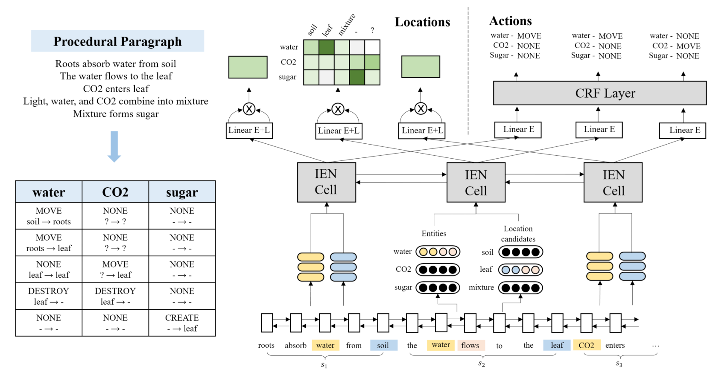

# Interactive Entity Network, IEN

### Overview

This repo contains the implementation of Interactive Entity Network, IEN, described in the EMNLP 2020 paper *Understanding Procedural Text using Interactive Entity Networks*.



IEN is a kind of RNN that designed for entity state tracking in procedural text. In each IEN cell, entities' states are maintained using memory slots, and different types of entity interactions are modeled by different attention matrices.

We also implement NCET in this repo.

### Usage

#### Requirements

This repo is written in Python 3.

To run the whole project, you need the python3 libraries listed below:

```
scikit-learn 0.22.1
pytorch 1.2.0
allennlp 0.9.0
nltk 3.4.5
```

Besides, word embeddings are needed. We use fastText wiki-news-300d-1M embeddings in our experiments, which can be downloaded from the [fastText official website](https://fasttext.cc/docs/en/english-vectors.html). Put the ``wiki-news-300d-1M.vec`` and ``wiki-news-300d-1M.vocab`` files to ``data/embedding/fasttext`` directory.

To run elmo-enhanced version,  you need to download the pre-trained elmo model from [AllenNLP](https://allennlp.org/elmo). We use the original elmo model. Put the ``elmo_2x4096_512_2048cnn_2xhighway_5.5B_weights.hdf5`` and ``elmo_2x4096_512_2048cnn_2xhighway_5.5B_options.json`` files to ``data/embedding/elmo`` directory.

The path to the embeddings can be configured in ``src/util/path.py``.

#### Preprocess

We have put the preprocessed data files in ``data/propara/data/train(dev,test)``, so this step can be skipped.

If you want to run the preprocess script your self, you need to download the [Stanford CoreNLP toolkit](https://stanfordnlp.github.io/CoreNLP/), and run a CoreNLP Server.

We use CoreNLP for POS tagging. So open the preprocess script ``src/preprocess/preprocess.py``, and fill in the CoreNLP Server's IP in line 97.

```
global st, wnl
st = CoreNLPParser(url='http://0.0.0.0', tagtype='pos')
wnl = WordNetLemmatizer()
```

Then we can run the script for preprocessing:

```
python3 src/exp/preprocess.py
```

#### Run

Run  ``src/exp/run.py`` , use ``-m`` to choose the model. We implement NCET in this repo as well.

```
# IEN
python3 src/exp/run.py -m IEN
# NCET
python3 src/exp/run.py -m NCET
```

The script automatically trains the model on the preprocessed ProPara dataset, and uses the [official evaluator](https://github.com/allenai/aristo-leaderboard/tree/master/propara) to evaluate the model. The result will be look like this:

```
=================================================
Question     Avg. Precision  Avg. Recall  Avg. F1
-------------------------------------------------
Inputs                0.807        0.716    0.759
Outputs               0.782        0.787    0.784
Conversions           0.564        0.491    0.525
Moves                 0.567        0.359    0.440
-------------------------------------------------
Overall Precision 0.680
Overall Recall    0.588
Overall F1        0.631
=================================================

Evaluated 54 predictions against 54 answers.
```

To run the elmo version, just set ``use_elmo=True`` in ``sec/config/propara.py``.

### Reference

```
@inproceedings{tang2020understanding,
  title={Understanding Procedural Text Using Interactive Entity Networks},
  author={Tang, Jizhi and Feng, Yansong and Zhao, Dongyan},
  booktitle={Proceedings of the 2020 Conference on Empirical Methods in Natural Language Processing (EMNLP)},
  pages={7281--7290},
  year={2020}
}
```

